# SOFTEC Competitions Data Extractor

This project fetches SOFTEC competitions data directly from the official API and generates:

- A structured CSV file with prizes, registration fees, and team-size limits.
- A local folder of competition logos with clean filenames.
- A local folder of competition PDF documents/details.

## Project Purpose

The script is designed to automate competition data collection for documentation and reporting, without scraping local HTML files.

## Data Source

- API Endpoint: `https://backend.softecnu.org/api/competitions_listable/`
- Input fields used: `name`, `registration_name`, `logo`, `details[].document`, `winner_Prize`, `runnerUp_Prize`, `fees`, `min_team_size`, `max_team_size`

## Output Files

| File / Folder | Description |
|---|---|
| `extract_competitions.py` | Python script that fetches API data and generates outputs |
| `competitions_data.csv` | Generated competition dataset |
| `competition_logos/` | Downloaded logo images (one per competition) |
| `competition_pdfs/` | Downloaded PDF/detail documents (ignored by Git) |

## CSV Schema

| Column | Description |
|---|---|
| `logo` | Logo filename stored in `competition_logos/` |
| `documents` | Pipe-separated PDF filenames stored in `competition_pdfs/` |
| `Competition Name` | Competition title |
| `Winner Prize` | Winner prize amount (PKR) |
| `Runner Up Prize` | Runner-up prize amount (PKR) |
| `Registration Fees` | Registration fee (PKR) |
| `Minimum Team Member Allowed` | Minimum team size |
| `Maximum Team Member Allowed` | Maximum team size |

## How to Run

```bash
python3 extract_competitions.py
```

After running, refresh `competitions_data.csv`, `competition_logos/`, and `competition_pdfs/`.

## Competitions Table

<table>
	<thead>
		<tr>
			<th align="left">Competition</th>
			<th align="center">Winner Prize</th>
			<th align="center">Runner Up Prize</th>
			<th align="center">Registration Fees</th>
			<th align="center">Min Team</th>
			<th align="center">Max Team</th>
		</tr>
	</thead>
	<tbody>
		<tr><td align="left" valign="middle"><nobr>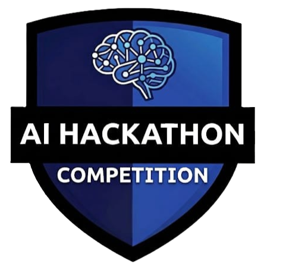 AI Hackathon</nobr></td><td align="center" valign="middle">100000</td><td align="center" valign="middle">50000</td><td align="center" valign="middle">5000</td><td align="center" valign="middle">2</td><td align="center" valign="middle">3</td></tr>
		<tr><td align="left" valign="middle"><nobr>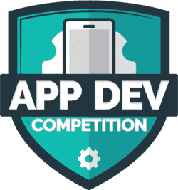 App Development Competition</nobr></td><td align="center" valign="middle">60000</td><td align="center" valign="middle">30000</td><td align="center" valign="middle">2500</td><td align="center" valign="middle">1</td><td align="center" valign="middle">3</td></tr>
		<tr><td align="left" valign="middle"><nobr>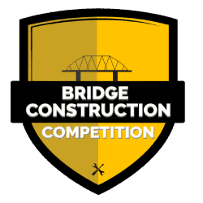 Bridge Construction Competition</nobr></td><td align="center" valign="middle">30000</td><td align="center" valign="middle">15000</td><td align="center" valign="middle">1700</td><td align="center" valign="middle">1</td><td align="center" valign="middle">2</td></tr>
		<tr><td align="left" valign="middle"><nobr>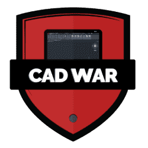 CAD War Competition</nobr></td><td align="center" valign="middle">25000</td><td align="center" valign="middle">10000</td><td align="center" valign="middle">1700</td><td align="center" valign="middle">1</td><td align="center" valign="middle">1</td></tr>
		<tr><td align="left" valign="middle"><nobr>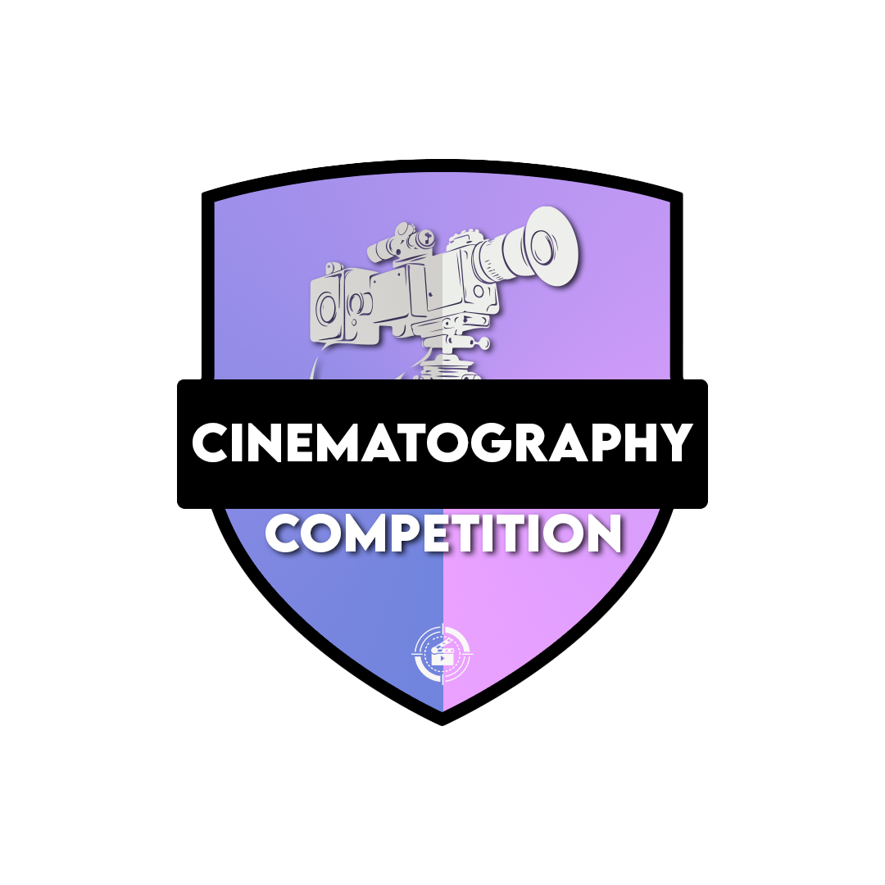 Cinematography Competition</nobr></td><td align="center" valign="middle">20000</td><td align="center" valign="middle">10000</td><td align="center" valign="middle">1500</td><td align="center" valign="middle">1</td><td align="center" valign="middle">1</td></tr>
		<tr><td align="left" valign="middle"><nobr> Cyber Security Competition</nobr></td><td align="center" valign="middle">50000</td><td align="center" valign="middle">25000</td><td align="center" valign="middle">2000</td><td align="center" valign="middle">1</td><td align="center" valign="middle">3</td></tr>
		<tr><td align="left" valign="middle"><nobr>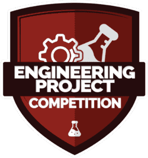 Engineering Project Competition</nobr></td><td align="center" valign="middle">70000</td><td align="center" valign="middle">35000</td><td align="center" valign="middle">3000</td><td align="center" valign="middle">1</td><td align="center" valign="middle">4</td></tr>
		<tr><td align="left" valign="middle"><nobr> Free Hand Sketching Competition</nobr></td><td align="center" valign="middle">20000</td><td align="center" valign="middle">10000</td><td align="center" valign="middle">1500</td><td align="center" valign="middle">1</td><td align="center" valign="middle">1</td></tr>
		<tr><td align="left" valign="middle"><nobr>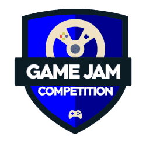 Game Jam Competition</nobr></td><td align="center" valign="middle">50000</td><td align="center" valign="middle">25000</td><td align="center" valign="middle">2500</td><td align="center" valign="middle">1</td><td align="center" valign="middle">4</td></tr>
		<tr><td align="left" valign="middle"><nobr>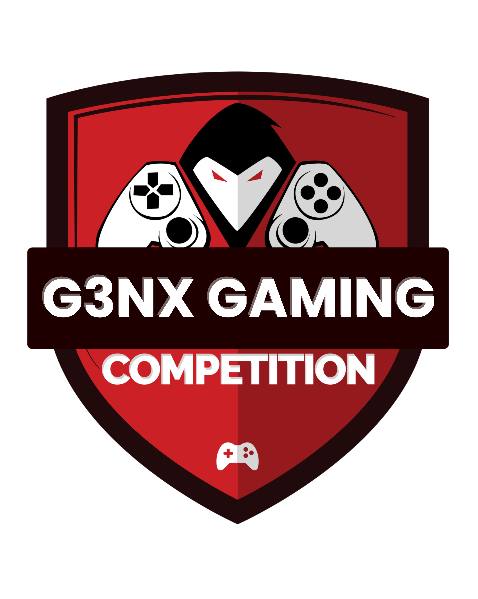 GenX Gaming</nobr></td><td align="center" valign="middle">20000</td><td align="center" valign="middle">10000</td><td align="center" valign="middle">2000</td><td align="center" valign="middle">1</td><td align="center" valign="middle">1</td></tr>
		<tr><td align="left" valign="middle"><nobr>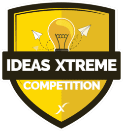 Ideas Xtreme</nobr></td><td align="center" valign="middle">25000</td><td align="center" valign="middle">20000</td><td align="center" valign="middle">3000</td><td align="center" valign="middle">1</td><td align="center" valign="middle">2</td></tr>
		<tr><td align="left" valign="middle"><nobr>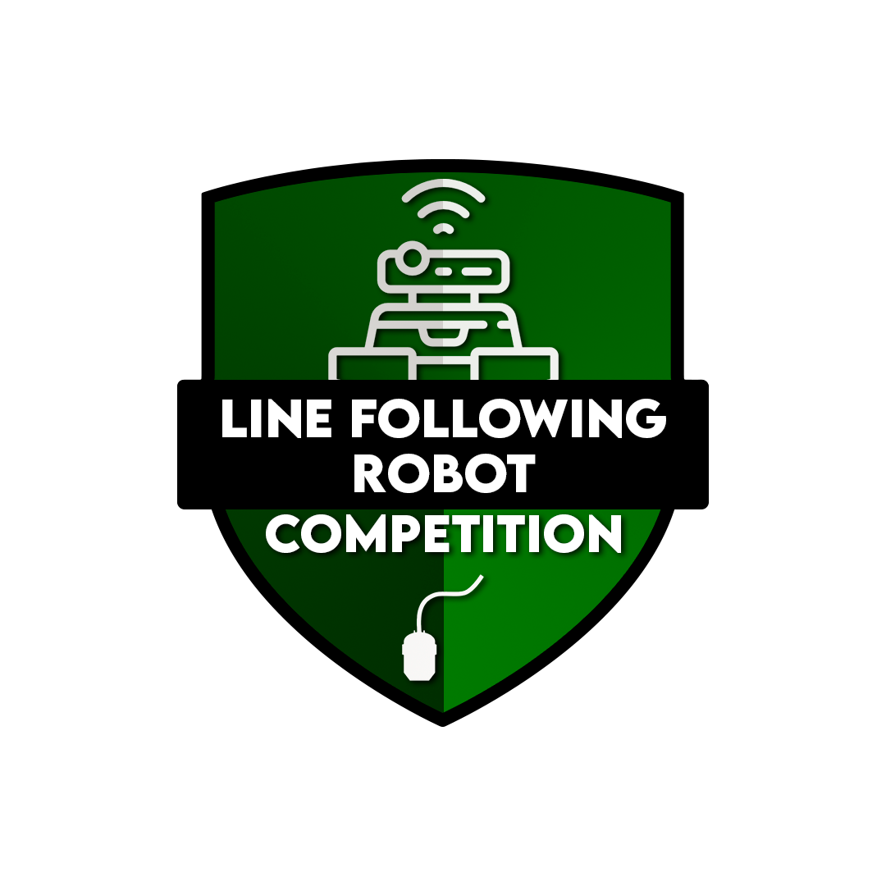 Line Following Robot</nobr></td><td align="center" valign="middle">30000</td><td align="center" valign="middle">15000</td><td align="center" valign="middle">2000</td><td align="center" valign="middle">3</td><td align="center" valign="middle">4</td></tr>
		<tr><td align="left" valign="middle"><nobr>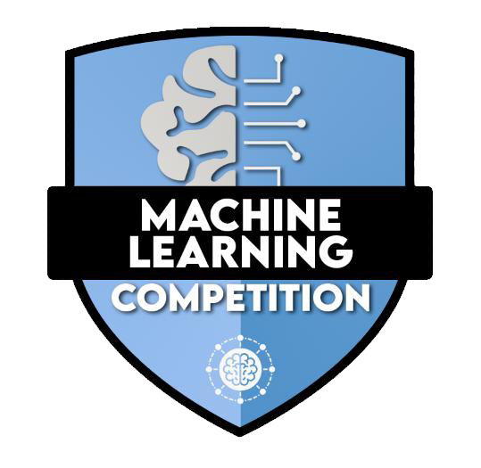 Machine Learning Competition</nobr></td><td align="center" valign="middle">80000</td><td align="center" valign="middle">40000</td><td align="center" valign="middle">3000</td><td align="center" valign="middle">1</td><td align="center" valign="middle">3</td></tr>
		<tr><td align="left" valign="middle"><nobr>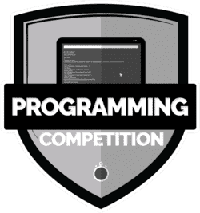 Programming Competition</nobr></td><td align="center" valign="middle">80000</td><td align="center" valign="middle">40000</td><td align="center" valign="middle">3000</td><td align="center" valign="middle">1</td><td align="center" valign="middle">3</td></tr>
		<tr><td align="left" valign="middle"><nobr> Query Vista Competition</nobr></td><td align="center" valign="middle">50000</td><td align="center" valign="middle">25000</td><td align="center" valign="middle">2000</td><td align="center" valign="middle">1</td><td align="center" valign="middle">2</td></tr>
		<tr><td align="left" valign="middle"><nobr>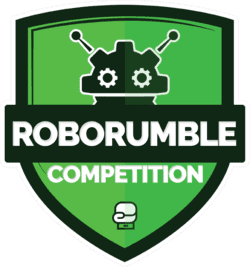 Robo Rumble</nobr></td><td align="center" valign="middle">100000</td><td align="center" valign="middle">50000</td><td align="center" valign="middle">5000</td><td align="center" valign="middle">1</td><td align="center" valign="middle">4</td></tr>
		<tr><td align="left" valign="middle"><nobr>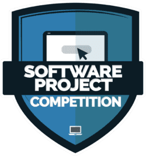 Software Project Competition</nobr></td><td align="center" valign="middle">80000</td><td align="center" valign="middle">40000</td><td align="center" valign="middle">2500</td><td align="center" valign="middle">1</td><td align="center" valign="middle">4</td></tr>
		<tr><td align="left" valign="middle"><nobr> UI/UX Competition</nobr></td><td align="center" valign="middle">30000</td><td align="center" valign="middle">15000</td><td align="center" valign="middle">1700</td><td align="center" valign="middle">1</td><td align="center" valign="middle">3</td></tr>
		<tr><td align="left" valign="middle"><nobr>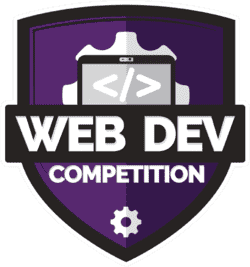 Web Development Competition</nobr></td><td align="center" valign="middle">80000</td><td align="center" valign="middle">40000</td><td align="center" valign="middle">2500</td><td align="center" valign="middle">1</td><td align="center" valign="middle">3</td></tr>
	</tbody>
</table>

## Notes

- Current API response contains 19 competitions.
- If API data changes, rerun the script to update CSV, logos, and PDF documents.
